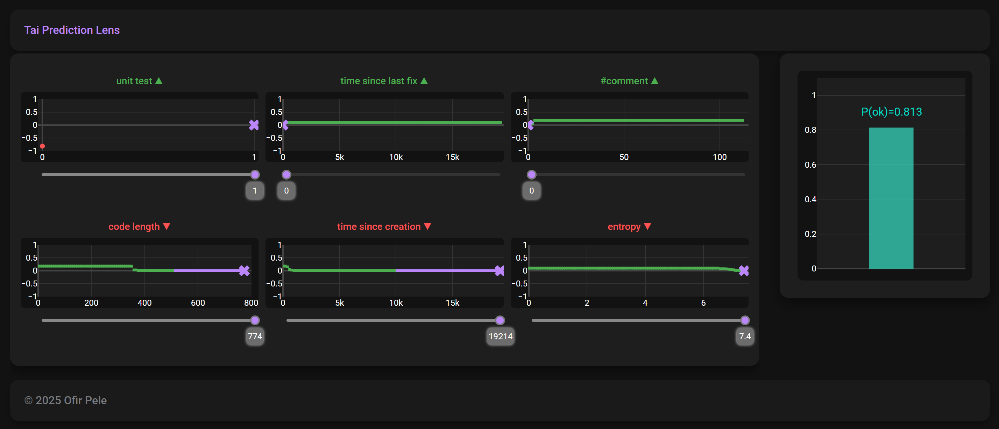

# Tai: Trustworthy AI 

**Author:** Ofir Pele (ofirpele@gmail.com)

## Overview

This library provides tools for building Trustworthy AI models. The main concept is to learn machine learning models that are monotonic across all features, where the monotonic constraints are learned automatically.

The model can combine both continuous and non-continuous components, making it as interpretable and trustworthy as a linear model while achieving accuracy that matches or outperforms state-of-the-art tabular models, particularly for risk factor datasets (e.g., healthcare applications).

## Visualization Tool

The library includes a visualization app for exploring classifier predictions:


On the right side, you can see the predicted probability score for a single example with 6 features. The visualization also shows how changes to any feature would affect the prediction. Notice that the top 3 features increase the probability of code health, while the bottom 3 features decrease it.

This tool can provide valuable insights, as demonstrated here:



This example shows that even when all features except unit tests are at their worst values for health, the probability of the code being healthy remains very high due to the presence of unit tests. This provides yet another proof that unit tests are important! 🙂

## Installation

- All commands should be run from the project root directory. 
- If uv is not installed the install script will try to install it via pip.
- If python is also not installed, the install script will try to install it assuming windows. 

```bash
source install.sh
```

## Running the Application

Use uv run to run any of the examples:

**Example 1:** To run the code quality experiment:
```bash
uv run src/examples/code_quality/main_experiment.py
```

**Example 2:** To run the code quality visualization tool :
```bash
uv run src/examples/code_quality/main_app_predicition_lens.py
```

## Data Access

Please note that the `examples/alzheimers_disease/data/` and `examples/heart_cleveland/data/` folders do not contain the actual data files. However, each folder includes a `README.md` file with links to access the required datasets.

## More Information

See <a href="./presentation/presentation.pdf">presentation.pdf</a> or clone repo and open `presentation/presentation.html` in your favorite browser.
