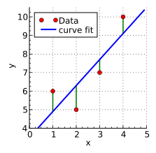

<!-- _class: centered -->

### Trustworthy AI (Tai): An Open-Source Framework
### for Interpretable Machine Learning 
### for Risk Factor Datasets
 

#### Ofir Pele, Ph.D.
#### Liat Pele, Ph.D.

<!-- 
We present Trustworthy AI (Tai), an open-source library designed to achieve state-of-the-art results for risk factor datasets while being fully interpretable. The Tai model is monotonic across all features, and the monotonicity constraints are automatically learned from data. The framework implements a novel approach based on lattice structures that combines the interpretability advantages of linear models with the predictive performance of state-of-the-art tabular learning algorithms, supporting both continuous and non-continuous model components. We include a visualization tool for model interpretation and feature impact analysis. Empirical evaluation demonstrates that Tai achieves predictive performance matching or exceeding current state-of-the-art tabular models while maintaining full model interpretability, making it particularly well-suited for risk assessment applications in domains requiring high interpretability such as healthcare and finance. Finally, we will discuss next steps.
GitHub: https://github.com/ofirpele/Tai
-->

---

## Why Interpretable?

* More accurate, especially with small risk factor data
* Identify target leakage
* Test data differs from training data, e.g., extrapolation scenarios
* Insights, especially actionable ones
* Encourage adoption
* Meet regulatory demands

---

## Model Performance - Code Health  

# 

---

## Visualization

# 

---

## Visualization - Insights

# 

---

## ML Models for Tabular Data - Trees 

 

    

    
    

    

	  
    

---

### Trees are Not Interpretable & Need Lots of Data

# 

<!-- _class: centered -->
Taken from <a href ="https://beenkim.github.io/slides/DLSS2018Vector_Been.pdf">Been Kim's presentation</a>

---

### Interpretable Models

 

<!-- Linear: By Krishnavedala - Own work, CC BY-SA 3.0, https://commons.wikimedia.org/w/index.php?curid=15462765-->
<!-- Piecewise - Own work, CC0, https://commons.wikimedia.org/w/index.php?curid=25133541 -->
<!-- Trees: https://raw.githubusercontent.com/dmlc/web-data/master/xgboost/model/twocart.png -->

Linear|Piecewise|Small Trees
:-----:|:-----:|:-----:
 |  | 

---

## Tai - Trustworthy AI 

* A "monotone universal approximator"
  - Every feature either monotonically increases the risk or monotonically decreases the risk
* Instead of enforcing constraints, we learn them from data
  - Currently using a linear model
* We use models that enable monotonic constraints:
  - Trees and Lattices

---

## Lattices

# 

<!-- _class: centered -->
Taken from https://ofirpele.github.io/papers/ICML2013.pdf

---

## Lattices

# 

<!-- _class: centered -->
Taken from https://jmlr.org/papers/volume17/15-243/15-243.pdf

---

## classifier_unit.TFL Training

# 

---

## classifier_unit.TFL Inference

# 

---

## TaiClassifier Training

# 

<!--
1. Linear regression to learn monotone direction for each feature
2. Fit each given classifier_unit 
3. If more than one classifier_unit, fit classifier_unit.TFL as an ensemble monotonically increasing for all classifier_unit predictions
-->

---

## TaiClassifier Inference

# 

---

## Model Performance - Code Health  

# 

---

## Model Performance - Heart Cleveland

# 

---

## Model Performance - Alzheimer

# 

---

## Future Directions

* More datasets
* More tasks: regression, RL, ...
* More shape constraints: conditional monotonicity, unimodal, ...
* Distill shape constraints from a Lattice&Tree learned model
* Report compatibility scores for learned shape constraints
* Research on the gap between Tai and non-constrained models
* Optimize code
* Use my implementation of lattices

---

## Future Directions

* Learn Lattice&Tree model together
* Adaptive lattice for RL
